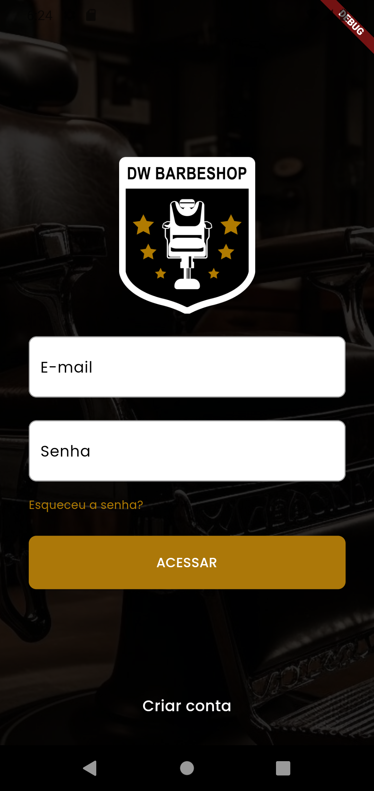
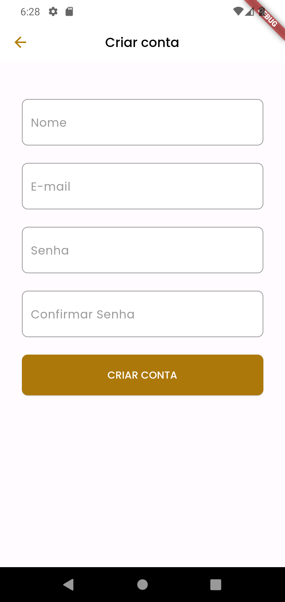
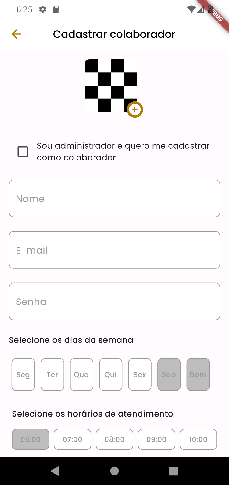
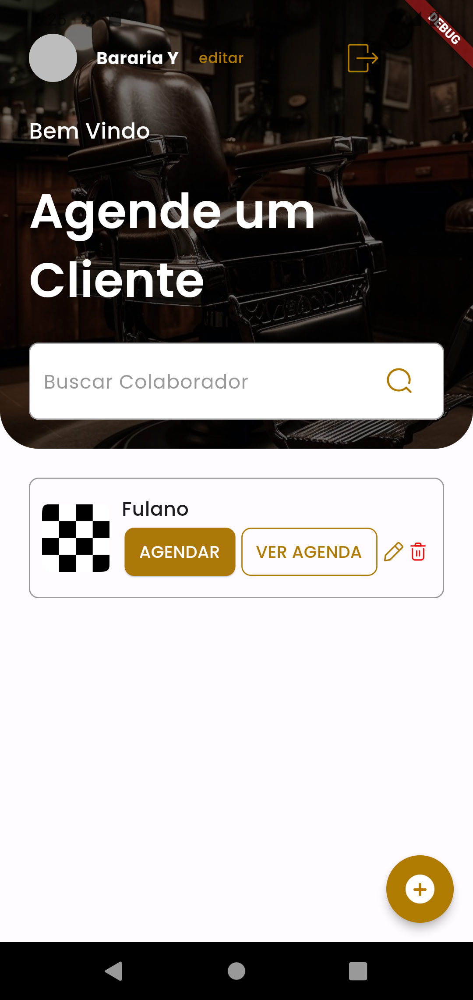
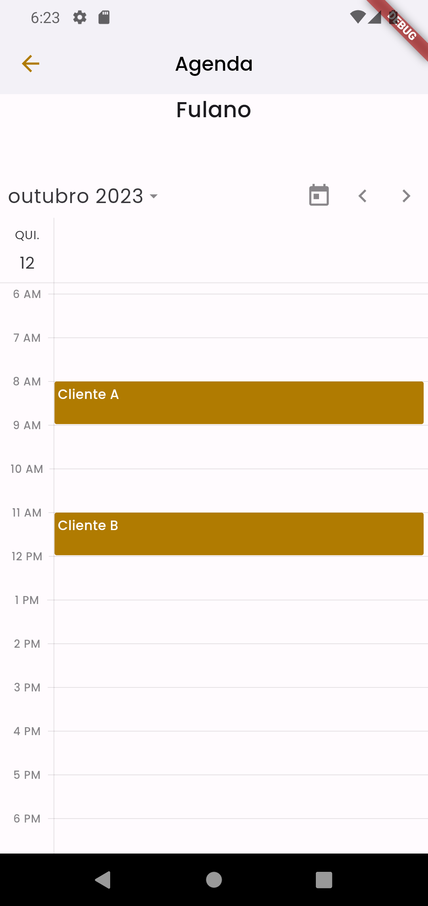
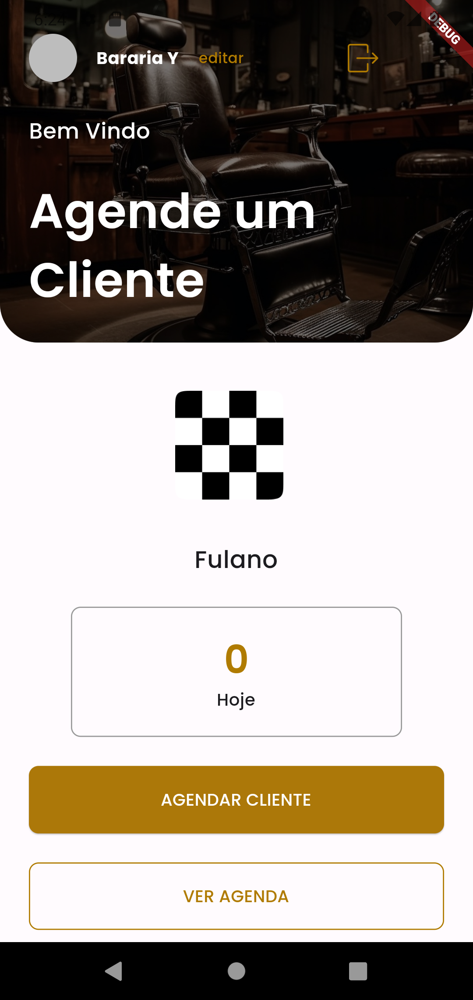
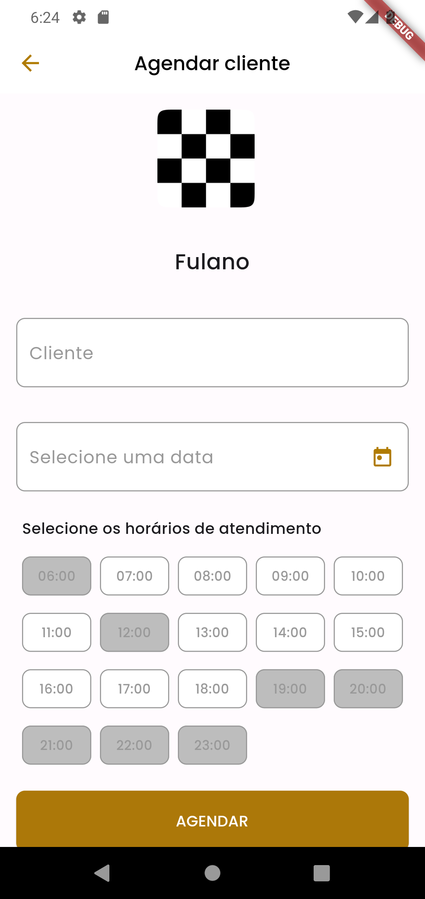

<h1
    align="center"
    style="color: #B07B01;"
>
    📲 DW Barbershop: O app perfeito para a sua barbearia 💇🏿️
</h1>

<h3
    style="color: #B07B01;"
>
    Está com dificuldades para lidar com agenda na sua barbearia? O DW Barbershop é o aplicativo perfeito para você🧔🏻️!
</h3>

Desenvolvido durante a imersão Dart Week 11, evento realizado pela Flutter Academy e ministrado por Rodrigo Rahman, o DW Barbershop permite que você, administrador, possa agendar clientes para qualquer um de seus colaboradores, além de visualizar a agenda de todos eles. E você, colaborador, pode consultar sua agenda a qualquer momento, além de agendar seus clientes da maneira mais simples e segura possível.

<h4>📰️ Sobre o evento: 🗞️</h4>

O objeto da Dart Week 11 foi criar, utilizando Flutter, um aplicativo de ponta a ponta, explorando os mais novos recursos do Dart 3 e gerenciando os estados com o Riverpod (substituto do Provider, é um framework reativo para gerenciamento de estados com funcionalidade de caching).

<h4>🛠 Tecnologias e ferramentas: 🛠</h4>
<ul>
    <li>Dart</li>
    <li>Flutter</li>
    <li>Riverpod</li>
    <li>Shares Preferences</li>
</ul>

<h4>📑 Recursos adicionais: ⌨</h4>
<ul>
    <li>Validações de formulários com <strong>Validatorless</strong></li>
    <li>Gerenciamento do loading de widgets que possuem estado assíncrono através do pacote <strong>Async State</strong></li>
    <li>Implementação de calendários e agendas por meio dos pacotes <strong>TableCalendar</strong> e <strong>Syncfusion Flutter Calendar</strong></li>
    <li>Utilização do locale <em>pt_BR</em> nos calendários e agendas através dos pacotes <strong>Flutter Localizations</strong> e <strong>Intl</strong></li>
</ul>

<h4>📷 Capturas de tela: 📷</h4>
<table>
    <tr>
        <td colspan="3">
            
        </td>
        <td colspan="3">
            
        </td>
    </tr>
    <tr>
        <td colspan="2">
            
        </td>
        <td colspan="2">
            
        </td>
        <td colspan="2">
            
        </td>
    </tr>
    <tr>
        <td colspan="3">
            
        </td>
        <td colspan="3">
            
        </td>
    </tr>
</table>